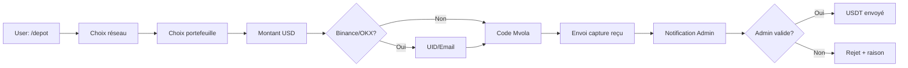
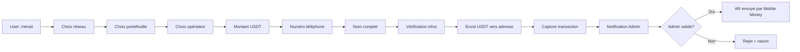

<div align="center">
  <h1>💱 FTA Exchange Bot</h1>
  <p>Bot Telegram automatisé pour l'échange USDT ↔ Ariary (MGA)</p>

  <p>
    
    
    
    
  </p>
</div>

---

## 📋 Table des Matières

- [À Propos](#-à-propos)
- [Fonctionnalités](#-fonctionnalités)
- [Stack Technique](#️-stack-technique)
- [Prérequis](#-prérequis)
- [Installation](#-installation)
- [Configuration](#️-configuration)
- [Utilisation](#-utilisation)
- [Structure du Projet](#-structure-du-projet)
- [Commandes Disponibles](#-commandes-disponibles)
- [Flux de Transaction](#-flux-de-transaction)
- [Gestion Admin](#-gestion-admin)
- [Sécurité](#-sécurité)
- [Limitations Actuelles](#️-limitations-actuelles)
- [Améliorations Futures](#-améliorations-futures)

---

## 🎯 À Propos

**FTA Exchange Bot** est un bot Telegram développé pour **Fundamental Trader Academy (FTA)** qui permet aux utilisateurs d'échanger des **USDT** (Tether) contre des **Ariary malgaches (MGA)** et vice-versa, via une interface conversationnelle simple et intuitive.

Le bot gère automatiquement:
- Les dépôts USDT avec paiement Mvola
- Les retraits USDT vers OKX, Binance ou Exness
- La validation des transactions par les administrateurs
- Les notifications en temps réel
- La gestion des sessions utilisateur (timeout 15 min)

---

## ✨ Fonctionnalités

### 🔹 Pour les Utilisateurs

- **Dépôt USDT**
  - Support de 3 réseaux: TRC20, BEP20, ERC20
  - Choix du portefeuille: OKX, Binance, Exness
  - Paiement via Mvola avec code USSD automatique
  - Envoi de preuve de paiement (capture d'écran)
  - Taux: **1 USDT = 4 600 AR**

- **Retrait USDT**
  - Sélection du réseau et du portefeuille de destination
  - Support Mvola et Orange Money
  - Vérification des informations utilisateur
  - Délai de 15 minutes pour envoyer le USDT
  - Taux: **1 USDT = 4 300 AR**

- **Consultation**
  - `/solde` - Voir son solde AR et USDT
  - `/taux` - Consulter les taux de change actuels
  - `/help` - Aide et guide d'utilisation

### 🔹 Pour les Administrateurs

- Réception des demandes de transaction avec captures
- Validation ou rejet via boutons inline
- Notifications automatiques aux utilisateurs
- Gestion multi-admin via `.env`
- Interface de gestion dédiée

---

## 🛠️ Stack Technique

| Technologie | Version | Utilisation |
|-------------|---------|-------------|
| **NestJS** | ^11.0.1 | Framework backend |
| **TypeScript** | ^5.7.3 | Langage principal |
| **Telegraf** | ^4.16.3 | Bibliothèque Telegram Bot API |
| **nestjs-telegraf** | ^2.9.1 | Intégration NestJS + Telegraf |
| **@nestjs/config** | ^4.0.3 | Gestion des variables d'environnement |
| **Node.js** | >= 18.x | Runtime JavaScript |

---

## 📦 Prérequis

- **Node.js** >= 18.x
- **npm** ou **yarn**
- Un **token de bot Telegram** (obtenu via [@BotFather](https://t.me/BotFather))
- Compte Telegram pour les tests
- Adresses de portefeuilles crypto (OKX, Binance)
- Numéro Mvola pour les paiements

---

## 🚀 Installation

### 1. Cloner le dépôt

```bash
git clone <url-du-repo>
cd telegram-bot
```

### 2. Installer les dépendances

```bash
npm install
```

### 3. Configurer les variables d'environnement

Créez un fichier `.env` à la racine:

```env
# Token du bot Telegram (obligatoire)
TELEGRAM_BOT_TOKEN=votre_token_ici

# Port du serveur (optionnel, défaut: 3000)
PORT=3000

# IDs Telegram des administrateurs (séparés par des virgules)
# Pour obtenir votre ID: envoyez un message à @userinfobot
ADMIN_IDS=123456789,987654321

# Adresses crypto de réception pour les retraits
WALLET_OKX_ADDRESS=votre_email_okx@example.com
WALLET_BINANCE_ADDRESS=votre_email_binance@example.com

# Numéro Mvola pour les dépôts
MVOLA_NUMBER=0340214510
```

### 4. Lancer le bot

**Mode développement:**
```bash
npm run start:dev
```

**Mode production:**
```bash
npm run build
npm run start:prod
```

---

## ⚙️ Configuration

### Obtenir le Token du Bot

1. Ouvrez Telegram et cherchez [@BotFather](https://t.me/BotFather)
2. Envoyez `/newbot` et suivez les instructions
3. Copiez le token fourni dans `.env`

### Obtenir votre ID Telegram

1. Envoyez un message à [@userinfobot](https://t.me/userinfobot)
2. Copiez votre ID numérique
3. Ajoutez-le dans `ADMIN_IDS` du `.env`

### Configurer les Taux de Change

Les taux sont définis dans [src/exchange/exchange.service.ts](src/exchange/exchange.service.ts:36):

```typescript
private readonly DEPOT_RATE = 4600;  // 1 USDT = 4600 AR
private readonly RETRAIT_RATE = 4300; // 1 USDT = 4300 AR
private readonly MIN_TRANSACTION = 10; // Minimum 10 USDT
```

---

## 💬 Utilisation

### Commandes Utilisateur

| Commande | Description |
|----------|-------------|
| `/start` | Afficher le message de bienvenue et les options |
| `/depot` | Déposer des USDT (acheter avec AR) |
| `/retrait` | Retirer des USDT (vendre pour AR) |
| `/solde` | Consulter son solde AR et USDT |
| `/taux` | Voir les taux de change actuels |
| `/help` | Obtenir de l'aide |

### Exemple de Flux Utilisateur

```
Utilisateur: /depot
Bot: Choix du réseau USDT (TRC20/BEP20/ERC20)
Utilisateur: [Sélectionne TRC20]
Bot: Choix du portefeuille (OKX/Binance/Exness)
Utilisateur: [Sélectionne Binance]
Bot: Entrez le montant USD
Utilisateur: 50
Bot: [Pour Binance/OKX] Entrez votre UID ou Email
Utilisateur: email@example.com
Bot: Composez ce code Mvola: #111*1*2*0340214510*230000*2*DEPOT_50USD#
Utilisateur: [Envoie capture du reçu Mvola]
Bot: Transaction envoyée aux admins pour validation
```

---

## 📁 Structure du Projet

```
telegram-bot/
├── src/
│   ├── main.ts                           # Point d'entrée de l'application
│   ├── app.module.ts                     # Module principal
│   ├── app.controller.ts                 # Contrôleur HTTP de base
│   ├── app.service.ts                    # Service de base
│   │
│   ├── telegram/                         # Module Telegram
│   │   ├── telegram.module.ts            # Configuration Telegraf
│   │   ├── telegram.update.ts            # Gestion des messages utilisateur
│   │   └── telegram-admin.update.ts      # Gestion des commandes admin
│   │
│   ├── exchange/                         # Module Exchange
│   │   ├── exchange.module.ts            # Module de gestion des échanges
│   │   └── exchange.service.ts           # Logique métier (calculs, transactions)
│   │
│   └── admin/                            # Module Admin
│       ├── admin.module.ts               # Module administrateur
│       └── admin.service.ts              # Gestion des notifications admin
│
├── test/                                 # Tests
│   ├── app.e2e-spec.ts
│   └── jest-e2e.json
│
├── .env                                  # Variables d'environnement (à créer)
├── .gitignore
├── package.json
├── tsconfig.json
├── nest-cli.json
└── README.md
```

---

## 🔄 Flux de Transaction

### Dépôt (Achat USDT avec AR)



### Retrait (Vente USDT pour AR)



---

## 👨‍💼 Gestion Admin

Les administrateurs reçoivent des notifications avec:

### Pour un Dépôt
- Photo du reçu Mvola
- Informations client (ID, username, nom)
- Détails de la transaction (montant, réseau, portefeuille)
- Boutons d'action: ✅ Approuver | ❌ Rejeter

### Pour un Retrait
- Photo de la transaction USDT
- Informations client
- Détails du retrait (montant, réseau, adresse)
- Informations de paiement (opérateur, numéro, nom)
- Boutons d'action: ✅ Approuver | ❌ Rejeter

### Actions Admin

Les admins cliquent directement sur les boutons inline pour valider ou rejeter. Le bot notifie automatiquement l'utilisateur du résultat.

---

## 🔒 Sécurité

⚠️ **Points de sécurité importants:**

1. **Variables sensibles**: Ne jamais commit le fichier `.env`
2. **Token bot**: À garder strictement confidentiel
3. **Admin IDs**: Seuls les IDs listés peuvent gérer les transactions
4. **Session timeout**: Les sessions expirent après 15 minutes d'inactivité
5. **Validation**: Tous les montants sont validés (minimum 10 USDT)

🔧 **Sécurité à améliorer:**

- Actuellement, les données sont stockées en mémoire (redémarrage = perte)
- Pas d'authentification utilisateur avancée
- Pas de logs d'audit persistants

---

## ⚠️ Limitations Actuelles

| Limitation | Impact |
|------------|--------|
| **Stockage en mémoire** | Les transactions et soldes sont perdus au redémarrage |
| **Pas de base de données** | Aucune persistance des données |
| **Gestion des photos** | Les photos sont transmises par `file_id` uniquement |
| **Pas de webhook** | Utilise le polling (moins optimal pour la production) |
| **Validation manuelle** | Toutes les transactions nécessitent validation admin |
| **Mono-devise** | Support uniquement USDT/AR |

---

## 🚀 Améliorations Futures

### Court Terme
- [ ] Ajouter une base de données (PostgreSQL/MongoDB)
- [ ] Implémenter TypeORM pour la persistance
- [ ] Ajouter des logs structurés (Winston)
- [ ] Système de webhooks Telegram
- [ ] Tests unitaires et e2e complets

### Moyen Terme
- [ ] Authentification KYC optionnelle
- [ ] Historique complet des transactions
- [ ] Dashboard admin web
- [ ] Support de plus de crypto-monnaies (BTC, ETH, etc.)
- [ ] Notifications push personnalisées
- [ ] Gestion des limites quotidiennes

### Long Terme
- [ ] API REST pour intégrations tierces
- [ ] Mode multi-langues (FR, EN, MG)
- [ ] Validation automatique via APIs bancaires
- [ ] Programme de parrainage
- [ ] Analytics et statistiques avancées
- [ ] Support client via IA

---

## 📜 Scripts NPM

```bash
# Développement
npm run start:dev          # Lance en mode watch
npm run start:debug        # Lance avec debugger

# Production
npm run build              # Compile TypeScript
npm run start:prod         # Lance la version compilée

# Tests
npm run test               # Tests unitaires
npm run test:watch         # Tests en mode watch
npm run test:cov           # Couverture de code
npm run test:e2e           # Tests end-to-end

# Qualité du code
npm run lint               # ESLint avec auto-fix
npm run format             # Prettier
```

---

## 📞 Support

Pour toute question ou problème:

- 📧 Email: votre.email@example.com
- 💬 Telegram: [@fta_exchange_bot](https://t.me/fta_exchange_bot)
- 🐛 Issues: [GitHub Issues](https://github.com/Randy0410/fta_exchange_bot/issues)

---

## 📄 Licence

Ce projet est sous licence **UNLICENSED** - Propriétaire privé de FTA (Fundamental Trader Academy).

---

<div align="center">
  <p>Développé avec ❤️ pour <b>Fundamental Trader Academy</b></p>
  <p>
    
    
  </p>
</div>
